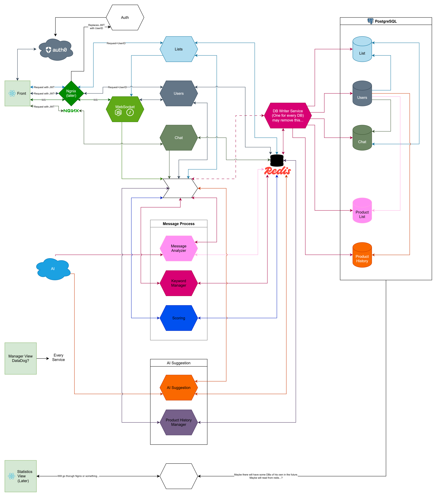
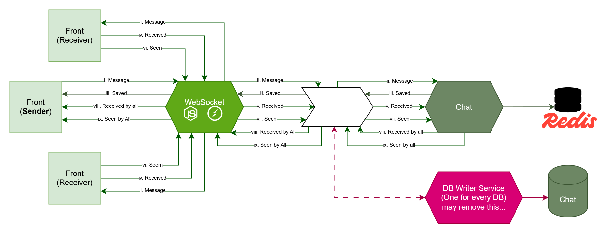

# CoList - Flows

## Overview

CoList is a collaborative platform that allows users to manage and share shopping lists.\
CoList also offers a B2B service, providing statistics and insights based on real user data

To serve both individual and business needs, CoList is organized into two segments:

1. **B2C** - The consumer-facing part of CoList.
2. **B2B** - Provides analytics and insights derived from user activity.

Respectively, the flows below are organized into those categories too.

&nbsp;

## Notes

Before continue, make sure you read the following notes:

> [!NOTE]
>
> **All events are logged in _Kafka_**
>
> Each event has `type`, `data` and `state` to them.\
> When failing service is reinitiated, it will look over all of the `"state": "started"` events, and retry them.
>
> For brevity, kafka logs are omitted from flow diagrams unless it plays a special role beyond standard logging.

> [!NOTE]
>
> **From _Redis_ to _DB_**
>
> All writes on _Redis_ are followed with notifications in _Kafka_ for the _DB Writer Service_ to push update
>
> For brevity, update _DB_ logs are omitted from flow diagram unless it plays a special role beyond standard role.\
> See [_DB Writer Service_](#db-writer-service) for implementation details.

> [!NOTE]
>
> **Scattered flows!**
>
> Some flows are distributed across multiple services because they are part of larger, overarching flows.\
> If you can’t find a sub-flow in one place, try searching within the larger flows it may belong to.

> [!NOTE]
>
> By default, `GET` requests return the full data.\
> When tailored response is required, the flow defines a response template.

> [!NOTE]
>
> For best visibility, open this MD file through Visual Studio Code, using the [Markdown Preview Enhanced](https://marketplace.visualstudio.com/items?itemName=shd101wyy.markdown-preview-enhanced)

&nbsp;

## Legend of symbols

| Symbol                     | Meaning                                                                                     |
| -------------------------- | ------------------------------------------------------------------------------------------- |
| &nbsp;&nbsp; ↓                     | Comes after or as a result of the previous step.                                            |
| &nbsp;&nbsp; ...          | Comes as a result of the previous step, but separated from the main flow.                   |
| Horizontal separation line | Separated a good amount of steps ago from the main flow, and started a big flow of its own. |

&nbsp;

## Architecture

   
   <figcaption style="margin-top: 0.2rem; text-align: center; font-size: 0.90rem; opacity: 60%;"> CoList Architecture v1.1</figcaption>

&nbsp;

## 1. B2C Flows

This part is organized into 3 categories:

1. **Base App** - consisting of:
   1. [_Auth Service_](#auth-service)
   2. [_Users Service_](#users-service)
   3. [_Lists Service_](#lists-service)
   4. [_Chat Service_](#chat-service)
   5. [_DB Writer Service_](#db-writer-service)

2. **Message Process** - consisting of:
   1. [_Message Analyzer Service_](#message-analyzer-service)
   2. [_Keyword Manager Service_](#keyword-manager-service)
   3. [_Scoring Service_](#scoring-service)

3. **AI Suggestions** - consisting of:
   1. [_AI Suggestions Service_](#ai-suggestions-service)
   2. [_Product History Manager Service_](#product-history-manager-service)

> [!NOTE]
>
> **All REST request must have JWT**
>
> All REST API requests pass through _Ngnix_, which sends them to the _Auth Service_ for JWT token validation.\
> Valid requests are modified to have `user_id` instead of JWT before forwarding to downstream services.
>
> For brevity, _Ngnix_ is omitted from flow diagrams unless it plays a service-specific role beyond standard authentication.
>
> See [_Auth Service_: JWT to `user_id` Flow](#jwt-to-userid) for implementation details.

&nbsp;

## 1.1. Base App

### _Auth Service_

Manages Login and JWTs

1. **Login**
   1. _Front_ redirect to _Auth0_
      \
      &nbsp;&nbsp; ↓

   2. User Login
      \
      &nbsp;&nbsp; ↓

   3. JWT is sent to the _Auth Service_
      \
      &nbsp;&nbsp; ↓

   - [ ] ==_TODO: FIGURE OUT WHATS NEXT_==

&nbsp;

2. **JWT to `user_id`**<span id="jwt-to-userid"></span>
   1. _Front_ sends `REST` request
      \
      &nbsp;&nbsp; ↓

   2. _Ngnix_ extracts JWT
      \
      &nbsp;&nbsp; ↓

   3. _Auth Service_ validates JWT, returns `user_id`
      \
      &nbsp;&nbsp; ↓

   4. _Ngnix_ adds `user_id` to headers
      \
      &nbsp;&nbsp; ↓

   5. Destination service receives request

&nbsp;

### _Users Service_

Manages users, user data, user settings

> [!NOTE]
>
> This service will be divided into Users Manager and Settings Service, when more settings will be added.

> [!NOTE]
>
> As _Auth Service_ is yet to be realized, flows might change in the future.

1. **Get Users / Setting**
   1. _Front_ sends a `GET` request
      \
      &nbsp;&nbsp; ↓

   2. _Users Service_ fetches users details from _Redis_.
      \
      &nbsp;&nbsp; ↓

   3. If type of detail is stored in _Auth0_, a `GET` request is sent from the _Users Service_.
      \
      &nbsp;&nbsp; ↓

   4. _Front_ receives users details in a list

&nbsp;

2. **Get User by `user_id`**
   1. _Front_ sends a `GET` request
      \
      &nbsp;&nbsp; ↓

   2. _Users Service_ fetches user details from _Redis_.
      \
      &nbsp;&nbsp; ↓

   3. _Front_ receives users details in an object

&nbsp;

3. **Update user / users**

   > [!NOTE]
   >
   > Settings are not shared with other users through the WS Connection.\
   > Any setting changes that impact other users (such as the `seen` status) will only take effect for them once they perform a new `REST` request.
   1. _Front_ sends a `PUT` request
      \
      &nbsp;&nbsp; ↓

   2. _Users Service_ update user details in _Redis_.\
      If detail is not in _Redis_ but in _Auth0_, updates it there.
      \
      &nbsp;&nbsp; ↓

   3. _Front_ receives users details in an object.

&nbsp;

4. **Update setting**

   > [!NOTE]
   >
   > Settings are not shared with other users through the WS Connection.\
   > Any setting changes that impact other users (such as the `seen` status) will only take effect for them once they perform a new `REST` request.
   1. _Front_ sends a `PUT` request
      \
      &nbsp;&nbsp; ↓

   2. _Users Service_ update setting in _Redis_.
      \
      &nbsp;&nbsp; ↓

   3. _Users Service_ sends `setting-updated` event to _Kafka_.
      \
      &nbsp;&nbsp; ↓

   4. _Front_ receives a `succeeded` response
      \
      &nbsp;&nbsp; ...

   5. Relevant service fetches event from _Kafka_ and updates correlated setting in _Redis_

&nbsp;

5. **Send connection status through _WebSocket Service_**

   > [!NOTE]
   >
   > This is part 1 of the combined flow for getting user status
   1. When user enters the app, the _Front_ receives all user details (see flow above).
      \
      &nbsp;&nbsp; ↓

   2. If allowed, and when WS Connection is open, _Front_ sends a WS Message that the user's connected
      \
      &nbsp;&nbsp; ↓

   3. _WebSocket Service_ broadcast the message through all of the rooms the user is part of
      \
      &nbsp;&nbsp; ↓

   4. _Front_ receives message, and ignores it unless the user is currently displayed in the chat settings
      \
      &nbsp;&nbsp; ...

   5. _Users Service_ sets connection status flag in _Redis_

&nbsp;

6. **Get User connection status**

   This flow is part of a bigger flow of getting list settings.\
   See [_Lists Service_ flows](#list-settings) for details

&nbsp;

7.  **Remove User**
    - **What will be removed:**
      1. All personal details, settings, and unshared lists.
      2. User data from _Auth0_

    - **What will stay:**
      1. `user_id` (and `removed` toggle will be on)
      2. All of the shared lists, closed or open. (Creator will be displayed as [Removed Account])
      3. Every mention of the user will display [Removed Account]\
         &nbsp;
    1.  _Front_ sends a `DELETE` request
        \
      &nbsp;&nbsp; ↓

    2.  _Users Service_ removes all of the details about the user, except it's `user_id` from _Redis_.\
        Toggles the `removed` value to `True`
        \
      &nbsp;&nbsp; ↓

    3.  If GDPR allows, stores single value for later reconnect the user to existing data.\
         _Users Service_ fetches this data from _Auth0_
        \
      &nbsp;&nbsp; ↓

    - [ ] ==_TODO: Check GDPR Guides_==
    4. _Auth Service_ removes user from _Auth0_
       \
      &nbsp;&nbsp; ↓

    5. _WebSocket Service_ removes the user from all of the rooms he's in.
       \
      &nbsp;&nbsp; ↓

    6. _Users Service_ returns an `operation succeeded` result to the _Front_
       \
      &nbsp;&nbsp; ↓

    7. _Front_ display the Sign Up page.
       \
      &nbsp;&nbsp; ...

    8. _Lists Service_ removes all of the associated lists that were not shared, including all associated items from _Redis_.
       \
      &nbsp;&nbsp; ↓

    9. _Chat Service_ removes all of the associated chats, including the messages there were sent, if any, from _Redis_.\
       (All of the messages sent by the removed user that are not part of unshared lists are saved though).
       \
      &nbsp;&nbsp; ↓

    10. _Product History Manager Service_ removes the list of latest items from _Redis_

&nbsp;

8. **Logout**
   1. _Front_ removes identification details from localhost
      \
      &nbsp;&nbsp; ↓

   2. _WebSocket Service_ removes the user from all of his rooms
      \
      &nbsp;&nbsp; ↓

   - [ ] ==_TODO: FIGURE OUT WHATS NEXT_==
         \
      &nbsp;&nbsp; ↓

   3. _Front_ displays Login Screen

&nbsp;

### _Lists Service_

1. **Get Lists**<span id="get-lists"></span>- _SSE_\
   This flow is used in the Home Page and focused on minimal metadata and preview-display specific data
   1. _Front_ sends `GET` request
      \
      &nbsp;&nbsp; ↓

   2. Lists are fetched from _Redis_.
      \
      &nbsp;&nbsp; ↓

   3. For every list, items are fetched from _Redis_ - 5 at most.
      \
      &nbsp;&nbsp; ↓

   4. Lists Service publishes event to Kafka, consumed by _Chat Service_
      \
      &nbsp;&nbsp; ↓

   5. **First response is sent to _Front_.**\
      _Content of Response:_

   ```JSON
   [
      {
         "id": "",
         "name": "",
         "update time": "",
         "silent": true,
         "items": [
            {
               "id": "",
               "content": "",
               "checked": false
            }
         ]
      }
   ]
   ```

   6. Displayed in _Front_
      ***
   7. _Chat Service_ read event from _Kafka_
      \
      &nbsp;&nbsp; ↓

   8. _Chat Service_ fetches amount of unread messages for every list, and last message
      \
      &nbsp;&nbsp; ↓

   9. **Second response is sent to the front.**\
      _Content of Response:_

   ```JSON
   [
      {
         "id": "",
         "unread_messages": 0,
         "last_message": ""
      }
   ]
   ```

   10. _Front_ display new data.
       \
      &nbsp;&nbsp; ↓

   11. SSE Closes.\
_Later updates are based on WS activities._

&nbsp;

2. **Get List by `list-id`**
   1. _Front_ sends `GET` request
      \
      &nbsp;&nbsp; ↓

   2. _Lists Service_ fetches list details and item list from _Redis_.
      \
      &nbsp;&nbsp; ↓

   3. _Lists Service_ returns the List to _Front_, with all metadata and items metadata.
      \
      &nbsp;&nbsp; ↓

   4. _Front_ displays list

&nbsp;

3. **Create new list**
   1. _Front_ sends a `POST` request
      \
      &nbsp;&nbsp; ↓

   2. _Lists Service_ creates a new empty list in _Redis_
      \
      &nbsp;&nbsp; ↓

   3. _Front_ displays the new list
      \
      &nbsp;&nbsp; ...

   4. _Chat Service_ creates a new chat for the associated list
      \
      &nbsp;&nbsp; ↓

   5. _WebSocket Service_ enters the user to associated room

&nbsp;

4. **Update List / Item / List Setting**
   1. _Front_ sends `POST` request
      \
      &nbsp;&nbsp; ↓

   2. List / Item is updated on _Redis_.\
      **For items** - when version number is lower than what's on _Redis_, new item is created instead of modification of existing item.
      \
      &nbsp;&nbsp; ↓

   3. _Front_ displays update.
      \
      &nbsp;&nbsp; ...

   4. _WebSocket Service_ broadcasting update / new item to all room members
      > [!NOTE]
      >
      > For the user who made the update, it displayed before being broadcasted. If there is a problem, silent retry and backup in localhost.

&nbsp;

5. **Share List**

   > [!NOTE]
   > **SMS not part of MVP**
   >
   > Apart from mentioning the SMS Service, the current flow does not include the SMS path.
   1. _Front_ sends `POST` request with list of `user_id` and unrecognized phone numbers
      \
      &nbsp;&nbsp; ↓

   2. _Lists Service_ adds members (who exists in the DB already) to list
      \
      &nbsp;&nbsp; ↓

   3. _Lists Service_ publishes events to _Kafka_, consumed by:
      - _Chat Service_ - adding existing users to chat
      - _SMS Service (planned)_ - sending invitations to sing up to CoList and enter the list
      - _WebSocket Service_ - list details (same structure as in the [get-lists flow](#get-lists))

      &nbsp;&nbsp; ↓

   4. _Front_ receives a `succeeded` response
      \
      &nbsp;&nbsp; ...

   5. _Chat Service_ enters users to equivalent chat
      \
      &nbsp;&nbsp; ↓

   6. _WebSocket Service_ adds users to room
      \
      &nbsp;&nbsp; ↓

   7. _WebSocket Service_ sends list details for every new member (fetched from _Kafka_)
      \
      &nbsp;&nbsp; ↓

   8. _Front_ (of new members) displays new list

&nbsp;

6. **Leave List**\
    Relevant only if the user is **NOT** the only member of the list
   1. _Front_ sends `PUT` request
      \
      &nbsp;&nbsp; ↓

   2. The _Lists Service_ removes the user from the list
      \
      &nbsp;&nbsp; ↓

   3. _Chat Service_ removes the user from the equivalent chat in _Redis_
      \
      &nbsp;&nbsp; ↓

   4. _WebSocket Service_ removes the user from the equivalent room
      \
      &nbsp;&nbsp; ↓

   5. _Front_ receives a `succeeded` response

&nbsp;

7. **Remove List**\
   Relevant only if the user **IS THE ONLY MEMBER** of the list
   1. _Front_ sends `DELETE` request
      \
      &nbsp;&nbsp; ↓

   2. The _Lists Service_ removes the list and all of the items from _Redis_
      \
      &nbsp;&nbsp; ↓

   3. _Front_ receives a `succeeded` response
      \
      &nbsp;&nbsp; ...

   4. _Chat Service_ removes chat and all of the message from _Redis_
      \
      &nbsp;&nbsp; ↓

   5. _WebSocket Service_ removes the user from the equivalent room

&nbsp;

8. **Close List**\
   This is different from removing the list. It leaves the list as it was.
   1. _Front_ sends `PUT` request
      \
      &nbsp;&nbsp; ↓

   2. _Lists Service_ changes the `state` in the `list_id` to `closed`
      \
      &nbsp;&nbsp; ↓

   3. _Front_ receives a `succeeded` response
      \
      &nbsp;&nbsp; ...

   4. _WebSocket Service_ keeps the users in the room, but it stops accepting any WS Message that is not "list is not closed anymore"

&nbsp;

9. **Get list settings**<span id="list-settings"></span> - _SSE_
   1. _Front_ sends a `GET` request with list of users with undefined connection status
      \
      &nbsp;&nbsp; ↓

   2. _Lists Service_ fetches data from _Redis_
      \
      &nbsp;&nbsp; ↓

   3. _Lists Service_ send response to front
      \
      &nbsp;&nbsp; ↓

   4. _Front_ displays data
      \
      &nbsp;&nbsp; ...

   5. _Users Service_ fetches connection status for each user in the list settings
      \
      &nbsp;&nbsp; ↓

   6. _Front_ displays data
      \
      &nbsp;&nbsp; ↓

   7. SSE Closes.\
_Later updates are based on WS activities._

&nbsp;

### _Chat Service_

1. **Get Chat by `chat-id`**
   1. _Front_ sends a `GET` request
      \
      &nbsp;&nbsp; ↓

   2. _Chat Service_ fetches chat details from _Redis_.
      \
      &nbsp;&nbsp; ↓

   3. _Front_ receives chat details and message in an object

&nbsp;

2. **Send message**

   
   <figcaption style="margin-top: 0.2rem; text-align: center; font-size: 0.90rem; opacity: 60%;; margin-bottom: -1.5rem">Representation of the flow</figcaption>

   &nbsp;
   1. _Front_ sends message through WS Connection
      \
      &nbsp;&nbsp; ↓

   2. WS Connection provides the message to the _Chat Service_, while broadcasting it to all of the room members
      \
      &nbsp;&nbsp; ↓

   3. _Chat Service_ writes all of the messages in _Redis_
      \
      &nbsp;&nbsp; ↓

   4. The _Front_ of all of the listeners receives the message, and ping the _WebSocket Service_
      \
      &nbsp;&nbsp; ↓

   5. The _WebSocket Service_ provides the ping messages to the _Chat Service_
      \
      &nbsp;&nbsp; ...

   6. For every user who sees the message (enters viewable area in _Front_), _Front_ sends `seen` WS Message
      \
      &nbsp;&nbsp; ↓

   7. The _WebSocket Service_ provides the `seen` messages to _Chat Service_
      \
      &nbsp;&nbsp; ...

   8. When _Chat Service_ sees that all of the listeners received the message,\
      it sends the sender a `received by all` WS Message.
      \
      &nbsp;&nbsp; ...

   9. When _Chat Service_ sees that all of the listeners saw the message,\
      it sends the sender a `saw by all` WS Message.

&nbsp;

3. **Edit message**
   1. _Front_ sends new new message content through WS Connection
      \
      &nbsp;&nbsp; ↓

   2. WS Connection sends new content to all listeners and to _Chat Service_
      \
      &nbsp;&nbsp; ↓

   3. _Chat Service_ stores new message content in _Redis_
      \
      &nbsp;&nbsp; ...

   4. All listeners' _Front_ display new content

&nbsp;

### _DB Writer Service_

All Services are writing and reading from _Redis_. Only the _DB Writer Service_ writes the _DB_, and when _Redis_ is re-instantiate, this service puts relevant data in _Redis_.

The _DB Writer Service_ updates the _DB_ every 30sec.\
For that reason, this is an async operation.

> [!NOTE]
>
> This service may not be part of MVP
